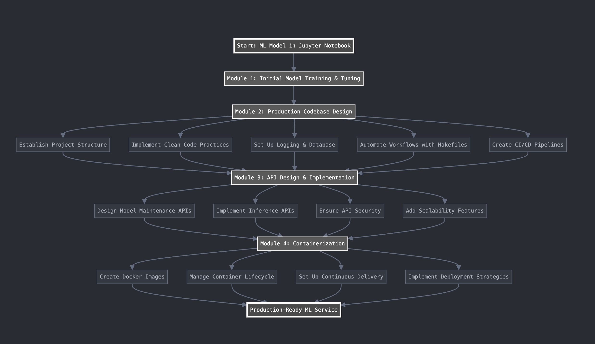
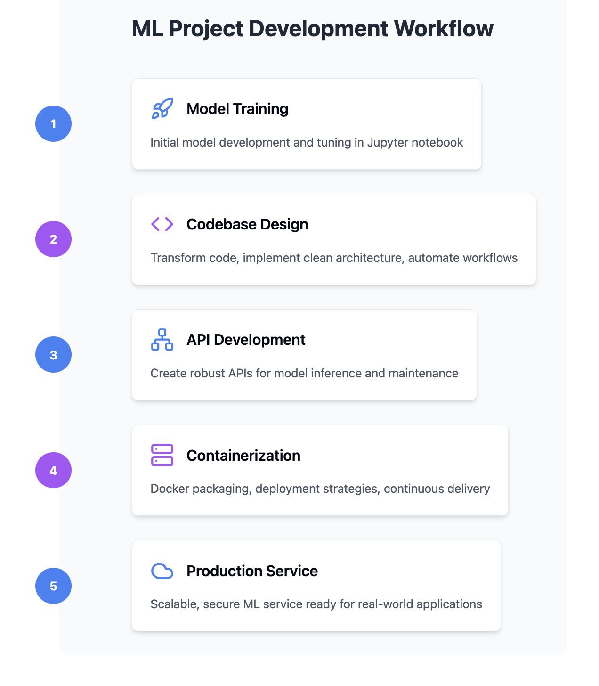

# Rental Price Prediction: End-to-End MLOps Project

## Project Overview

This project is an end-to-end MLOps pipeline for predicting rental prices. The system leverages a Random Forest model trained on real estate data to provide rental price predictions. The project is structured to handle data ingestion, preprocessing, model training, evaluation, and prediction, with a robust logging mechanism and scalable deployment features.

## Project Structure

```bash
rental-price-prediction/
│
├── notebook/                  # Exploratory Data Analysis
│   └── model_baseline.ipynb   # Baseline notebook for model evaluation
│
│── app/
│   ├── templates/             # HTML templates  
│   │   └── index.html          # Index page
│   └── app.py                 # API for prediction service
│
├── src/
│   ├── config/                # Configuration Management
│   │   ├── __init__.py        # Project-wide settings and imports
│   │   ├── .env               # Environment-specific configurations
│   │   ├── db.py              # Database connection and settings
│   │   ├── logger.py          # Logging configuration
│   │   └── model.py           # Model configuration settings
│
│   ├── db/                    # Database Interaction Layer
│   │   ├── db_model.py        # SQLAlchemy ORM models
│   │   └── db_sqlite          # SQLite database storage
│
│   ├── models/                # Machine Learning Components
│   │   ├── pipe/              # Data Processing Pipeline
│   │   │   ├── data_collection.py   # Data acquisition
│   │   │   ├── data_preparation.py  # Data preprocessing
│   │   │   └── model.py             # Model training utilities
│   │   │
│   │   ├── model/             # Model Training and Management
│   │   │   ├── model.py       # Core model training logic
│   │   │   └── model_services.py  # Model loading and prediction services
│   │   │
│   │   └── model_services.py  # Additional model service layer
│
│   ├── logs/                  # Application Logging
│   │   └── app.log            # Centralized log file
│
│   └── runner.py              # Main application entry point
│
├── tests/                     # Unit Test Suite
│   ├── test_data_collection.py
│   ├── test_model_training.py
│   └── test_prediction.py
│
├── docs/                      #  ML Project Documentation
│   ├── architecture.md
│   └── usage_guide.md
│
├── .gitignore
├── README.md
├── Makefile
├── poetry.lock
└── pyproject.toml
```

## Project Structure

The project is organized as follows:
## Tools and Packages Used

- **Python**: Core programming language for building the pipeline.
- **pandas**: Data manipulation and analysis.
- **numpy**: Numerical computing.
- **SQLAlchemy**: ORM for database interactions.
- **pydantic**: Data validation and management.
- **Poetry**: Package manager for Python.
- **scikit-learn**: Machine learning library for model training and evaluation.
- **Loguru**: Logging library for tracking pipeline processes.
- **Flask**: Web framework for API deployment.
- **Celery**: Asynchronous task queue.
- **Docker**: Containerization for deploying the entire pipeline.
- **DBeaver**: Database management tool. 
- **Pickle**: Model serialization and deserialization.

# Full Lifecycle of ML model development and deployment: 


## Start: ML Model in Jupyter Notebook

The initial prototyping and exploration phase, where the ML model is developed and tested in a Jupyter Notebook environment.

---

## Module 1: Initial Model Training & Tuning

Focuses on the initial training and optimization of the ML model.

---

## Module 2: Production Codebase Design

Involves designing a production-ready codebase, including:
- Establishing the project structure.
- Implementing clean code practices.
- Setting up logging and database management.

---

## Module 3: API Design & Implementation

Covers designing and implementing APIs for the ML model:
- Maintenance APIs.
- Inference APIs.
- Ensuring API security and scalability.

---

## Module 4: Containerization

Application containerization using Docker, including:
- Creating Docker images.
- Managing the container lifecycle.
- Setting up continuous delivery.
- Implementing deployment strategies.

---

## Final Outcome: Production-Ready ML Service

A production-ready ML service that can be seamlessly deployed and scaled as needed.

## ML Project Development Workflow:
